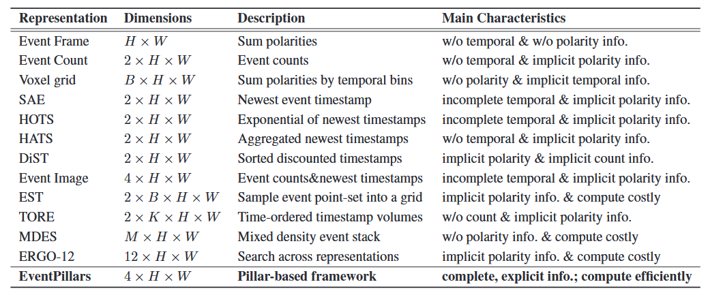

## Notes
- Questions:
    - Alignment of RGB and Event (DepthAnyevent/DSEC paper?)
    - How is dense depth collected?
- Event representations
    - Concentration network
    - Tencode
    - 

- VFM, event camera, Application
- 2-3 adaptations
- List representation methods

- depth estimation with event
- VFM with/without events
- event/representations